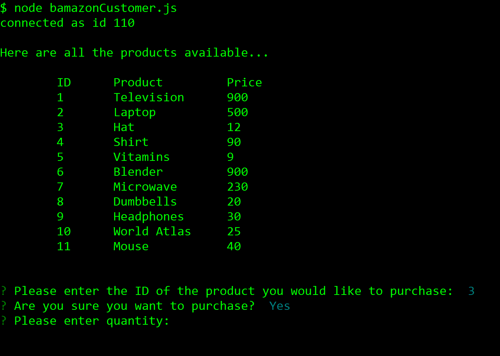

# BAMAZON

### Overview

Bamazon is an Amazon-like storefront. The app will take in orders from _Customers_ and deplete stock from the store's inventory. The app will also allow a _Manager_ to check on inventory and add or update inventory as needed.

### FEATURES

**CUSTOMER APP**

Terminal command: `node bamazonCustomer.js`

* This will display all the available products for sale and their respective prices. It will then prompt the user to enter the _ID_ of the product they wish to purchase.
Screenshot:    

* After the customer confirms the product to purchase, the app will ask the customer the _quantity_ (of the item) they wish to purchase.
Screenshot:    

* After the customer confirms the quantity needed, the purchase is complete and the total cost of the transaction will be displayed. The inventory for that product will be reduced accordingly.
Screenshot:    

* IF the customer does not confirm either the product or the quantity, the transaction will be cancelled.
Screenshot:    

* IF the store does not have enough of the product to meet the customer's request, the transaction will not be completed.
Screenshot:    

**MANAGER APP**

Terminal command: `node bamazonCustomer.js`

* The app will load a set of menu options:

    * View Products for Sale
    * View Low Inventory
    * Add to Inventory
    * Add New Product
Screenshot:    [Manager Menu](Images\manager_mainMenuView.PNG)

* When a manager selects `View Products for Sale`, the app will list every available item: the item IDs, names, prices, and quantities.
Screenshot:    [View Products](Images\manager_viewProductsView.PNG)

* When a manager selects `View Low Inventory`, the app will list all items with an inventory count lower than five.
Screenshot:    [Low Inventory](Images\manager_lowInventoryView.PNG)

* When a manager selects `Add to Inventory`, the app will display a prompt that will let the manager "add more" of any item currently in the store.
Screenshot:    [Add Inventory](Images\manager_addInventoryView.PNG)

* When a manager selects `Add New Product`, the app will allow the manager to add a completely new product to the store.
Screenshot:    [Add Product](Images\manager_addProductView.PNG)

* When a manager selects `Exit`, the app will exit.
Screenshot:    [Exit](Images\manager_exitView.PNG)

**Hope you have fun in the store**
